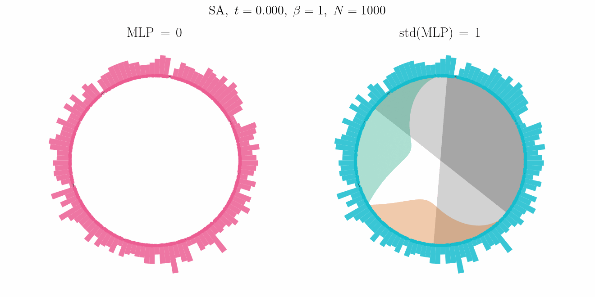
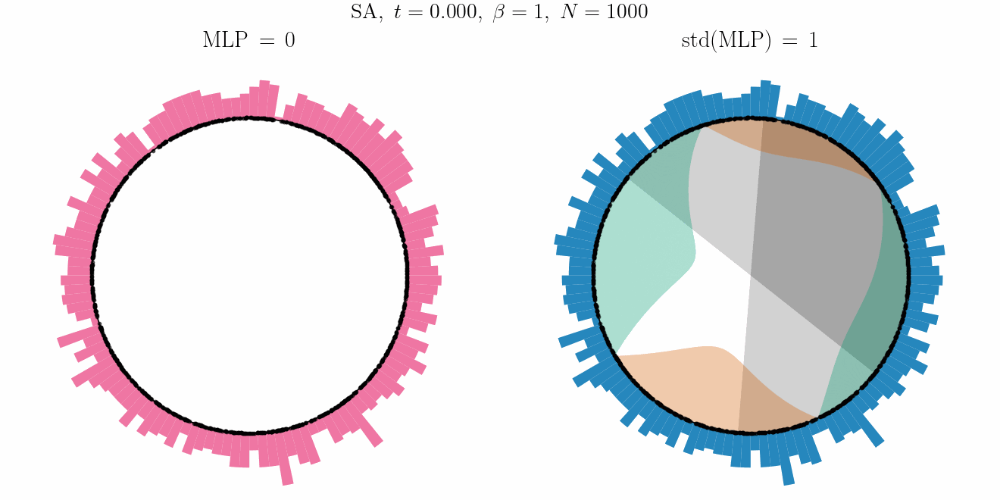

# Transformer Dynamics as Wasserstein Gradient Flow

This repo simulates transformer-style dynamics (self-attention + MLP) on compact
manifolds, interpreted as Wasserstein gradient flows. Two geometries are supported:

- **S¹ (circle)**: dimension = 2
- **S² (sphere)**: dimension = 3 (animations in the folder wgf_sphere)

**Unnormalized self-attention + Gradient Ascent (ReLU)**


**Normalized self-attention + Gradient Ascent (ReLU)**


**Unnormalized self-attention + Gradient Descent (GeLU)**


**Normalized self-attention + Gradient Descent (GeLU)**




Two attention variants are available: unnormalized self-attention (USA) and
normalized self-attention (SA).

## Model

### S¹ (Circle)

Let $x_i(t) = (\cos \theta_i(t), \sin \theta_i(t)) \in S^1$ and
$t(\theta) = (-\sin \theta, \cos \theta)$ be the unit tangent. Define

$$
w_{ij} = \exp\bigl(\beta (x_i \cdot x_j - 1)\bigr)
       = \exp\bigl(\beta (\cos(\theta_i - \theta_j) - 1)\bigr).
$$

### S² (Sphere)

Let $x_i(t) \in S^2 \subset \mathbb{R}^3$ with $\|x_i\| = 1$. Define

$$
w_{ij} = \exp\bigl(\beta (x_i \cdot x_j - 1)\bigr).
$$

### MLP Drift

The MLP drift is a tangent vector field:

$$
u_{\mathrm{MLP}}(x) = \Pi_x \sum_{m=1}^k \omega_m\, \sigma(a_m \cdot x),
$$

where $a_m \in S^{d-1}$, $\omega_m \in \mathbb{R}^d$, $\sigma \in \{\mathrm{relu}, \mathrm{gelu}\}$,
and $\Pi_x$ is the projection onto the tangent space at $x$.

When `gradient_MLP=true`, we constrain $\omega_m = s_m a_m$ so the MLP is a gradient field.

### Dynamics

**Unnormalized self-attention (USA):**

$$
A_i = \frac{1}{N} \sum_{j=1}^N w_{ij} \Pi_{x_i}(x_j - x_i).
$$

**Normalized self-attention (SA):**

$$
A_i = \frac{\sum_{j=1}^N w_{ij} \Pi_{x_i}(x_j - x_i)}{\sum_{j=1}^N w_{ij}}.
$$

Total drift is $A_i + u_{\mathrm{MLP}}(x_i)$. The dynamics are:

$$
\dot{x}_i =
\begin{cases}
A_i + u_{\mathrm{MLP}}(x_i), & \texttt{ascending=true} \\
-(A_i + u_{\mathrm{MLP}}(x_i)), & \texttt{ascending=false}
\end{cases}
$$

For USA, the self-attention drift corresponds to the gradient flow of

$$
\mathsf{E}_\beta[\mu] = \frac{1}{2\beta} \iint e^{\beta (x \cdot y - 1)}\, d\mu(x)\, d\mu(y).
$$

## Quick Start

1) Install dependencies

```bash
pip install -r requirements.txt
```

2) Edit `config.json` with your settings.

See `CONFIG.md` for all configuration options and valid values.

3) Run

```bash
python3 main.py
```

## Outputs

Outputs are written under `results/experiment_YYYYMMDD_HHMMSS`. Each beta
produces its own run folder.

### Common outputs (S¹ and S²)

- `params.json` — full parameters and seeds
- `summary.json` — per-beta cluster counts for stats aggregation

### S¹ specific outputs

- `gamma_k.pdf` — eigenvalue spectrum
- `trajs/trajectories_null*.pdf` — null model (MLP=0) trajectories
- `trajs/trajectories_MLP*.pdf` — MLP trajectories (with potential background when `gradient_MLP=true`)
- `histograms/histogram_{init,middle,final}*.pdf` — particle distribution over time (final also saved as `histograms/histogram*.pdf`)
- `mlp_potential*.pdf` — MLP potential $v(\theta)$ (gradient MLP only)
- `energy.pdf`, `energy_log.pdf` — energy vs time (null + MLP)
- `evolution_*.gif` — animated evolution (if `gif_sphere=true`)

### S² specific outputs

- `sphere/mlp_potential.pdf` — MLP potential surface (gradient MLP only)
- `sphere/init_{null,mlp}.pdf` — initial particle configuration
- `sphere/middle_{null,mlp}.pdf` — mid-evolution snapshot
- `sphere/final_{null,mlp}.pdf` — final configuration
- `hist/init_{null,mlp}.pdf` — 3D bar histogram at initial time
- `hist/middle_{null,mlp}.pdf` — 3D bar histogram at middle time
- `hist/final_{null,mlp}.pdf` — 3D bar histogram at final time
- `hist/final_mlp_boundaries.pdf` — final histogram with MLP decision boundaries
- `sphere/trajectory_{null,mlp}.pdf` — 3D trajectory plot (linear time scale, if `pdf_trajectory=true`)
- `sphere/trajectory_{null,mlp}_log.pdf` — 3D trajectory plot (log time scale, if `pdf_trajectory=true`)
- `sphere_evolution.gif` — animated sphere evolution (if `gif_sphere=true`)
- `sphere_histogram.gif` — animated histogram (if `gif_histogram=true`)
- `sphere_views.html` — interactive 3D visualization with:
  - MLP vs Null comparison
  - Initial/Middle/Final time states
  - Points vs Histogram display modes
  - Potential field overlay toggle
  - PDF/PNG export buttons

### summary.json contents

Each beta's `summary.json` includes:
- `beta`, `sqrt_beta`, `params_json` — run metadata
- `null_counts`, `mlp_counts`, `null_mode_counts`, `mlp_mode_counts` — final cluster statistics
- `null_mass_counts`, `mlp_mass_counts` — clusters above mass threshold (S¹)
- `null_cluster_masses`, `mlp_cluster_masses` — all cluster masses at convergence
- `heaviest_mass_null`, `heaviest_mass_mlp` — heaviest cluster mass
- `null_cluster_times`, `mlp_cluster_times` — convergence times
- `positions_initial`, `positions_middle_*`, `positions_final_*` — particle positions
- `histogram_edges`, `*_histogram_densities` — histogram bins/densities
- `energy_times_*`, `energy_values_*` — energy time series
- `mlp_a`, `mlp_omega`, `mlp_activation` — MLP parameters
- `null_stop_reasons`, `mlp_stop_reasons` — termination reasons
- `max_drift_final_null`, `max_drift_final_mlp` — max drift magnitude at stopping time
- `runtime_seconds` — wall clock time

### Experiment-level outputs

At the experiment root:

- `stats/cluster_count.pdf` — cluster count vs √β (MLP only)
- `stats/cluster_count_with_null.pdf` — cluster count vs √β (MLP + null)
- `stats/mass_count.pdf` — mass-count vs √β (MLP only, S¹)
- `stats/mass_count_with_null.pdf` — mass-count vs √β (MLP + null, S¹)
- `stats/heaviest_mass.pdf` — heaviest (and smallest non-spurious) cluster masses vs √β
- `stats/all_masses.pdf` — all cluster masses vs √β
- `stats/energy_overlay*.pdf` — energy overlays across betas (linear/log, with/without legend)
- `mlp_scale_sweep.json` — when `mlp_scale` is a list

## Resuming Experiments

If you cancel a run, you can resume by setting `experiment_dir` to the existing
experiment folder:

```json
"experiment_dir": "results/experiment_20260120_123456"
```

The system detects completed betas by matching `params.json` and skips them.
Stats are generated from all available `summary.json` files at the end.

## Memory Optimization

For large simulations (many particles, long runs), memory usage is optimized:

- Full histories are only saved when needed for GIFs or trajectory plots
- Set `gif_sphere=false`, `gif_histogram=false`, `pdf_trajectory=false` to minimize memory
- Memory is explicitly freed after each beta with garbage collection

## Repo Structure

```
main.py                 # Entry point; loads config and dispatches to d=2 or d=3
config.json             # User configuration
CONFIG.md               # Reference of all config options
requirements.txt        # Python dependencies
results/                # Output folder with experiment runs

wgf_circle/             # S¹ (d=2) implementation
  config.py             # Config parsing/validation
  runner.py             # Simulation loop and output generation
  dynamics.py           # Attention/MLP drift and integrators
  analysis.py           # Clustering metrics and convergence
  plotting.py           # Matplotlib plots and GIF generation
  io.py                 # Filesystem helpers and JSON utilities

wgf_sphere/             # S² (d=3) implementation
  config_S2.py          # Config parsing/validation
  runner_S2.py          # Simulation loop and output generation
  dynamics_S2.py        # Attention/MLP drift on S²
  analysis_S2.py        # Clustering on sphere (geodesic distance)
  plotting_S2.py        # 3D plots, histograms, interactive HTML
```

## Dependencies

- numpy, scipy — numerical computation
- matplotlib — static plots
- Pillow, imageio — GIF generation
- plotly (optional) — interactive HTML visualizations
